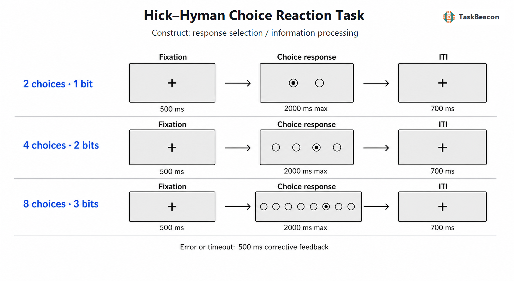

# Hick–Hyman 选择反应任务：信息不确定性、反应选择与认知控制的实验研究

在多个刺激—反应映射之间迅速选出适当动作，是研究有限信息加工能力的基本问题。单纯延长反应时并不能定位其来源：刺激辨认、反应选择、动作编程和速度—准确性权衡均可能改变从刺激出现到按键的总时程。Hick–Hyman 选择反应任务（Hick–Hyman choice reaction task）通过系统改变备选刺激—反应对的数量或概率，把选择情境的不确定性表示为信息量，并检验正确反应时是否随信息量增加。其经典关系为 $RT=a+bH$；当 $N$ 个选项等概率时，$H=\log_2N$，斜率 $b$ 表示每增加 1 bit 不确定性所增加的反应时。该范式由此把实验操作、可量化的认知负荷与行为时程联系起来，并成为反应选择、认知控制、多选项决策及个体差异研究的重要基准（Hick, 1952; Hyman, 1953; Proctor & Schneider, 2018）。

## 1. 范式提出与理论背景

Hick（1952）在不同数量等概率灯光与相应按键之间建立一一映射，发现平均反应时与选项数的二进制对数近似线性。他以通信系统的有限通道容量解释这一规律，并将斜率的倒数理解为信息获得速率。Hyman（1953）进一步改变事件概率，表明反应时不仅取决于选项总数，还随刺激概率及平均信息量而变。这一扩展使“Hick 定律”更准确地成为 Hick–Hyman 定律：操作核心是选择不确定性，而非屏幕上项目数量本身。

经典信息论解释具有清楚的描述价值，但反应时按 bit 线性增长并不能证明人在逐次执行二分搜索。后续研究发现，练习、刺激—反应相容性、刺激可辨性、反应方式、序列重复和极大集合规模均能改变斜率或导致偏离；熟练而高度相容的映射甚至可显著压低集合大小效应（Schneider & Anderson, 2011; Proctor & Schneider, 2018）。记忆提取模型据此将规律解释为刺激—反应联结提取时的联想干扰与重复试次的提取节省，而非单一通道容量（Schneider & Anderson, 2011）。将刺激集合和反应集合分别操控后，视觉刺激—口头反应任务中的大部分效应可归于反应不确定性，说明经典的一一映射设计同时改变了刺激与反应两端，不能仅凭集合大小效应断言瓶颈位于刺激编码阶段（Wifall et al., 2016）。

现代多选项决策模型进一步说明，同一对数关系可由不同计算过程产生。贝叶斯观察者模型能够在证据积累达到判据时作答，并同时描述集合大小、错误率与速度—准确性权衡；错误率是否随选项数增加，取决于参与者在不同条件下是否改变决策谨慎度（Hawkins et al., 2012）。最优策略模型则表明，多选项决策可由归一化、紧迫信号和随时间变化的非线性边界实现，Hick 关系是若干合理决策策略的宏观结果，而不是某一种算法的专属指纹（Tajima et al., 2019; Baker et al., 2022）。

## 2. 任务逻辑、流程与核心测量

标准试次先呈现注视或准备信号，随后出现一个目标刺激；目标属于预先学习的一组刺激，每个刺激对应唯一反应。参与者在规定时限内尽快且准确作答，程序记录按键、反应时、正确性与漏答。等概率设计通常设置 1、2、4、8 等响应数量，对应 0、1、2、3 bit；不等概率设计使用 $H=-\sum_i p_i\log_2p_i$ 表示平均不确定性。条件可以按区组呈现以维持稳定映射，也可在同一区组中通过线索改变有效响应集合。前者易于说明规则，却使集合大小与区组顺序、练习程度及手指数量共同变化；后者减少区组混淆，但线索解释本身增加了加工阶段。

主要因变量是各信息量条件下正确试次的反应时均值或中位数、$RT$ 对 $H$ 的回归斜率与截距、拟合优度、准确率和漏答率。斜率反映对集合大小操控敏感的时程成分；截距包含视觉编码、基础动作启动及设备延迟等未随信息量变化的成分。两者都是混合指标，不能分别等同于纯粹“决策速度”和“运动速度”。错误试次不能简单丢弃后便忽略：若高不确定性条件以更多错误换取较小反应时增量，正确反应时斜率会低估选择负荷。因此应联合报告反应时与准确率，必要时采用分布模型或证据积累模型检验决策边界、非决策时间和积累效率的变化（Hawkins et al., 2012; Tajima et al., 2019）。

试次阶段与心理构念的对应关系也需限定。准备阶段主要涉及当前映射和有效响应集合的维持；目标出现后的早期时段包含刺激辨认与不确定性表征；从目标身份到按键的转换负荷集中体现于反应选择；按键前后的运动准备与执行贡献于总反应时。`高信息量 > 低信息量` 的反应时差异因此支持选择情境增加了总体加工需求，但只有在刺激呈现、映射相容性、运动幅度和反馈均受控时，才可较有把握地归因于反应选择。连续试次中的刺激或反应重复通常更快，且其收益随集合大小而变；若各条件重复概率不同，集合大小斜率会混入序列效应（Schneider & Anderson, 2011; Annand et al., 2021）。

## 3. 主要行为与神经科学发现

### 3.1 行为规律与计算解释

跨任务证据较一致地支持：在映射已学习、选项可辨且强调又快又准的强迫选择条件下，平均正确反应时随 $\log_2N$ 近似线性增加（Proctor & Schneider, 2018）。该群体水平规律对程序参数并非不敏感。练习可使斜率下降，相容映射比任意映射更平坦，重复试次快于转换试次；时间压力还会重新分配反应时和错误率，而非等比例压缩所有加工阶段（Schneider & Anderson, 2011; Hawkins et al., 2012）。2026 年比较 2、4、8 选项的强迫选择与自由选择发现，强迫选择呈现陡峭的集合大小效应，自由选择的效应明显减弱，说明外部规定正确反应的任务不能直接代表自主偏好选择（Zhao et al., 2026）。

这一规律也不具有跨物种、效应器和任务结构的无条件普遍性。近期鸽类研究在控制目标位置后仍未得到预期的正向 Hick 斜率，表明刺激位置、相容性、训练史和物种特有反应组织会决定规律能否出现（Flaim et al., 2023）。因此，“更多选项必然导致更慢决策”只适用于操作条件相近的强迫选择任务；视觉搜索、菜单查找、价值选择和眼跳任务中的集合大小效应可能包含不同过程。

### 3.2 fMRI 与 EEG 所揭示的加工阶段

事件相关功能磁共振成像（functional magnetic resonance imaging, fMRI）研究显示，当实际刺激和作答动作保持一致、仅改变潜在反应选项数时，反应时仍随信息量上升；额上回、后扣带及顶叶活动随条件发生系统变化，支持反应集合情境参与选择准备，但脑区活动方向并不一致，不能用单个区域概括“信息加工速率”（Woo & Lee, 2007）。参数化操控熵的研究进一步发现，认知控制网络活动随信息量增强、默认模式网络活动减弱；中介分析中只有认知控制网络活动解释了部分熵—反应时关系（Wu et al., 2018）。视觉与听觉概率任务中，认知控制网络对情境熵和单事件惊异度均表现出跨模态响应，提示该网络参与不确定信息与行为反应的协调，而非仅响应某一种视觉映射（Wu et al., 2021）。这些结果是条件相关 BOLD 信号及统计中介证据，尚不足以证明网络活动是 Hick 斜率的唯一原因。

脑电图（electroencephalography, EEG）能够补充时间进程。Zhao 等（2026）使用时间信号分解比较强迫选择与自由选择，强迫选择中的集合大小同时调节较早的 N2 与较晚的 P3 相关活动，自由选择则呈现不同的额叶评价活动模式。结果支持信息负荷影响早期竞争处理和后期控制配置，但头皮信号源定位的空间精度有限，N2、P3 也不是反应选择的专一标记。结合 fMRI 与 EEG，较稳妥的结论是：选项不确定性改变从表征、竞争到动作生成的分布式过程；现有证据不支持把每 bit 反应时增量定位为单一脑区或单一时间窗。

## 4. 发展、临床与个体差异应用

Hick–Hyman 范式常用于检验年龄相关加工减慢，因为它能区分总体反应时升高与随信息负荷增加的额外减慢。近期研究分别操控外部线索给定的响应数量和由概率结构维持的内部不确定性，发现老年人的负荷相关减慢更明显，且外部线索条件的年龄差异更大；高内部不确定性下，老年人对预期与非预期事件的区分也减弱（Korthauer et al., 2024）。阿尔茨海默病研究采用卡片分类变体发现，患者在高响应不确定性时出现更明显的反应时与错误损害，且表现与执行功能相关（Korthauer et al., 2019）。这些变体拓展了范式的临床价值，同时也改变了刺激、记忆和分类需求，所得差异不能直接解释为通用信息通道容量下降。

个体差异研究曾将 Hick 斜率视为心理加工速度指标，并用于解释智力差异。复测研究提示，条件均值的群体关系稳定，并不保证个体斜率可靠；由少数条件均值拟合的斜率受试次噪声、异常反应以及截距—斜率共享误差影响（Jensen, 1987）。固定载荷潜变量模型能够从条件反应时中分离与选项数操控相关的方差，该成分与心理能力存在关联，但它不同于单个被试的普通最小二乘斜率（Rammsayer et al., 2017）。因此，临床或个体差异研究应预先评估当前版本的重测信度，增加每个信息水平的有效试次，并避免以一次测得的 ms/bit 斜率作个体诊断。

## 5. 测量效度与解释边界

该范式具有明确的操控效度：等概率选项使信息量可由 $\log_2N$ 直接计算，反应时—信息量函数也便于跨条件比较。其构念效度取决于实验控制。增加选项数往往同步增加视觉对象、有效手指、空间跨度和映射记忆负荷；刺激与反应不确定性在一一映射中亦相互混淆（Wifall et al., 2016）。研究者若要把斜率解释为反应选择成本，应保持目标辨认难度与动作幅度一致、平衡区组顺序、检验重复/转换试次，并联合分析错误率。若研究问题涉及概率，应按实际概率计算熵和单试次惊异度，不能以集合大小替代二者。

群体平均函数的拟合优度回答“总体效应是否近似对数线性”，个体斜率信度回答“被试排序能否重复”，两者不可互换。仅设置 2、4、8 三个水平时，个体 $R^2$ 很容易受单个条件均值影响；固定 2 s 截止又可能选择性截断高负荷条件的慢反应。建议同时呈现各条件反应时分布、准确率、漏答率与速度—准确性关系，使用层级模型估计个体差异，并在独立样本或复测中验证斜率。神经影像分析还应区分目标出现、反应和反馈事件；相关活动与统计中介不构成因果证据。经过这些限定，Hick–Hyman 任务更适合用作不确定性对强迫反应选择影响的实验测量，而非一般决策能力、智力或临床状态的单一指标。

## 6. TaskBeacon 中的任务实现

### 6.1 任务资源与访问入口

| 资源 | ID | 用途 | 地址 |
|---|---|---|---|
| 完整任务源码 | T000099 | PsychoPy 行为实验与本地数据采集 | [GitHub](https://github.com/TaskBeacon/T000099-hick-hyman-choice-reaction-task) |
| 浏览器伴随源码 | H000099 | 同流程的网页行为版 | [GitHub](https://github.com/TaskBeacon/H000099-hick-hyman-choice-reaction-task) |
| 在线运行入口 | H000099 | 无需采集硬件的浏览器体验 | [TaskBeacon Web Runner](https://taskbeacon.github.io/psyflow-web/?task=H000099-hick-hyman-choice-reaction-task) |

T000099 是当前完整实验实现；H000099 为浏览器伴随版本，用于网页行为测量与体验。两者均标记为行为采集，网页版本不等同于 EEG 或 fMRI 采集协议。

### 6.2 实现流程与关键参数

TaskBeacon 当前版本采用 2、4、8 选一的等概率空间映射，分别对应 1、2、3 bit。参与者完成 3 个区组，每区组 32 试次；六种区组顺序依据被试编号分配。八个位置从左至右映射 A/S/D/F/J/K/L/;，2 选一仅使用 F/J，4 选一使用 D/F/J/K。目标界面不显示键名，以减少试次内文字读取对反应时的影响。主要输出为各集合大小的正确反应时、准确率、漏答率、重复标记，以及普通最小二乘拟合的截距、ms/bit 斜率和 $R^2$。该实现不含在线自适应控制。

**图 1. TaskBeacon T000099 的区组与试次流程。** 每次试次依次呈现 500 ms 注视、由 2/4/8 个轮廓圆及一个实心目标组成的选择画面、条件性纠错反馈和 700 ms 试次间隔。选择画面最长保留 2000 ms；参与者按目标空间位置对应键作答，正确反应直接进入间隔，错误或漏答呈现 500 ms 的正确键反馈。2、4、8 选一条件分别使用中央 2 个、中央 4 个和全部 8 个位置，各位置在 32 试次区组内等概率出现。任务不调整时限或难度，区组次序通过六种排列平衡；分析仅以正确试次估计 Hick 斜率，并另行报告准确率和漏答率。

## 参考文献

Annand, C. T., Fleming, S. M., & Holden, J. G. (2021). Farey trees explain sequential effects in choice response time. *Frontiers in Physiology, 12*, Article 611145. https://doi.org/10.3389/fphys.2021.611145

Baker, S.-A., Griffith, T., & Lepora, N. F. (2022). Degenerate boundaries for multiple-alternative decisions. *Nature Communications, 13*, Article 5066. https://doi.org/10.1038/s41467-022-32741-y

Flaim, M., Guo, J., & Blaisdell, A. P. (2023). Choice reaction time in pigeons fails to increase as predicted by Hick’s law. *Behavioural Processes, 206*, Article 104838. https://doi.org/10.1016/j.beproc.2023.104838

Hawkins, G., Brown, S. D., Steyvers, M., & Wagenmakers, E.-J. (2012). Context effects in multi-alternative decision making: Empirical data and a Bayesian model. *Cognitive Science, 36*(3), 498–516. https://doi.org/10.1111/j.1551-6709.2011.01221.x

Hick, W. E. (1952). On the rate of gain of information. *Quarterly Journal of Experimental Psychology, 4*(1), 11–26. https://doi.org/10.1080/17470215208416600

Hyman, R. (1953). Stimulus information as a determinant of reaction time. *Journal of Experimental Psychology, 45*(3), 188–196. https://doi.org/10.1037/h0056940

Jensen, A. R. (1987). Process differences and individual differences in some cognitive tasks. *Intelligence, 11*(2), 107–136. https://doi.org/10.1016/0160-2896(87)90001-8

Korthauer, L. E., Festa, E. K., Gemelli, Z. T., He, M., & Heindel, W. C. (2024). Effects of aging on externally cued and internally driven uncertainty representations. *Neuropsychology, 38*(3), 249–258. https://doi.org/10.1037/neu0000936

Korthauer, L. E., Salmon, D. P., Festa, E. K., Galasko, D., & Heindel, W. C. (2019). Alzheimer’s disease and the processing of uncertainty during choice task performance: Executive dysfunction within the Hick/Hyman law. *Journal of Clinical and Experimental Neuropsychology, 41*(4), 380–389. https://doi.org/10.1080/13803395.2018.1564813

Proctor, R. W., & Schneider, D. W. (2018). Hick’s law for choice reaction time: A review. *Quarterly Journal of Experimental Psychology, 71*(6), 1281–1299. https://doi.org/10.1080/17470218.2017.1322622

Rammsayer, T. H., Pahud, O., & Troche, S. J. (2017). Decomposing the functional relationship between speed of information processing in the Hick paradigm and mental ability: A fixed-links modeling approach. *Personality and Individual Differences, 118*, 17–21. https://doi.org/10.1016/j.paid.2017.01.050

Schneider, D. W., & Anderson, J. R. (2011). A memory-based model of Hick’s law. *Cognitive Psychology, 62*(3), 193–222. https://doi.org/10.1016/j.cogpsych.2010.11.001

Tajima, S., Drugowitsch, J., Patel, N., & Pouget, A. (2019). Optimal policy for multi-alternative decisions. *Nature Neuroscience, 22*, 1503–1511. https://doi.org/10.1038/s41593-019-0453-9

Wifall, T., Hazeltine, E., & Mordkoff, J. T. (2016). The roles of stimulus and response uncertainty in forced-choice performance: An amendment to Hick/Hyman law. *Psychological Research, 80*(4), 555–565. https://doi.org/10.1007/s00426-015-0675-8

Woo, S.-H., & Lee, K.-M. (2007). Effect of the number of response alternatives on brain activity in response selection. *Human Brain Mapping, 28*(10), 950–958. https://doi.org/10.1002/hbm.20317

Wu, T., Dufford, A. J., Egan, L. J., Mackie, M.-A., Chen, C., Yuan, C., Chen, C., Li, X., Liu, X., Hof, P. R., & Fan, J. (2018). Hick–Hyman law is mediated by the cognitive control network in the brain. *Cerebral Cortex, 28*(7), 2267–2282. https://doi.org/10.1093/cercor/bhx127

Wu, T., Schulz, K. P., & Fan, J. (2021). Activation of the cognitive control network associated with information uncertainty. *NeuroImage, 230*, Article 117703. https://doi.org/10.1016/j.neuroimage.2020.117703

Zhao, S., Hommel, B., & Beste, C. (2026). The neurophysiology underlying Hick’s law: A dissociation of forced-choice and free-choice decision-making. *NeuroImage, 327*, Article 121764. https://doi.org/10.1016/j.neuroimage.2026.121764
